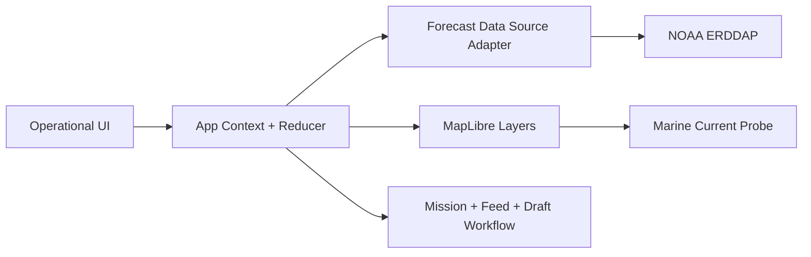

# Triton Coastal OS


Operational coastal intelligence console for municipal sargassum response. This project focuses on forecast-informed decision support, mission operations visibility, and report-ready evidence workflows.

## Table of Contents

- Overview
- Core Capabilities
- Technology Stack
- Architecture
- Getting Started
- Environment Configuration
- Data Sources and Integrity Notes
- Commands
- Testing and CI
- Project Structure
- Security and Secrets Guidance
- Roadmap
- Contributing

## Overview

Triton Coastal OS delivers a command-style interface for coastal operations teams. The app combines live map visualization, forecast-derived risk indicators, operational feed updates, and mission planning actions in a single UI.

Current emphasis areas:

- Decision support for near-term shoreline impact
- Operational mission generation and deployment tracking
- Evidence-oriented workflows, including FEMA draft preview
- Resilient client behavior when external sources are unavailable

## Core Capabilities

### Operational Dashboard

- Jurisdiction-focused command snapshot
- Risk and impact summaries with model qualifiers
- Activity feed and mission state management

### Map Operations

- Forecast trajectory overlays
- Interactive current probe with direction and speed
- Current vector rendering and animated flow particles
- Layer toggles and timeline controls

### Decision Support

- Rule-based recommendation engine from live app state
- Dynamic recommendation list based on available assets and jurisdiction
- Timestamped update indicators for forecast freshness

### Reporting Support

- FEMA draft preview modal
- Mission attachment context for documentation readiness

## Technology Stack

- React 19
- TypeScript 6
- Vite 8
- MapLibre GL
- Recharts
- Vitest
- Oxlint

## Architecture



### Data Path Summary

1. Forecast adapter retrieves index data.
2. Snapshot fields are mapped into context state.
3. UI modules subscribe to context and render decision support and map overlays.
4. Operational actions write events to feed for traceability.

## Getting Started

### Prerequisites

- Node.js 20+
- npm 10+

### Install

```bash
npm install
```

### Run in Development

```bash
npm run dev
```

### Production Build

```bash
npm run build
npm run preview
```

## Environment Configuration

Create a local environment file named .env.local in project root.

```bash
VITE_SARGASSUM_SOURCE=noaa-erddap
VITE_NOAA_AFAI_DATASET_ID=noaa_aoml_atlantic_oceanwatch_AFAI_1D
VITE_NOAA_BBOX=24.8,26.7,-80.4,-79.8
VITE_MAP_PROVIDER=maplibre
VITE_GOOGLE_MAPS_API_KEY=
```

### Variable Reference

| Variable | Required | Default | Description |
| --- | --- | --- | --- |
| VITE_SARGASSUM_SOURCE | No | mock | Data source mode: mock or noaa-erddap |
| VITE_NOAA_AFAI_DATASET_ID | No | noaa_aoml_atlantic_oceanwatch_AFAI_1D | NOAA ERDDAP dataset id |
| VITE_NOAA_BBOX | No | 24.8,26.7,-80.4,-79.8 | Bounding box: minLat,maxLat,minLon,maxLon |
| VITE_MAP_PROVIDER | No | maplibre | Map provider: maplibre or google |
| VITE_GOOGLE_MAPS_API_KEY | Conditional | (empty) | Required only when VITE_MAP_PROVIDER=google |

If Google Maps is selected but no key is provided, the app automatically falls back to MapLibre.

## Data Sources and Integrity Notes

Current forecast conversions from AFAI into risk, probability, and biomass are explicitly marked in the UI as modeled heuristic estimates. They are not calibrated scientific biomass measurements.

Key principles implemented in this codebase:

- Heuristic outputs are labeled as modeled estimates
- Forecast freshness is visible in the UI
- Fallback behavior is explicit when remote data is unavailable

Planned evolution:

- Replace heuristic constants with validated methodology once available
- Add methodology reference links in product docs and help tooltips

## Commands

| Command | Description |
| --- | --- |
| npm run dev | Start local dev server |
| npm run build | Type-check and build production bundle |
| npm run preview | Serve built output locally |
| npm run lint | Run Oxlint |
| npm run test | Run Vitest in watch mode |
| npm run test:run | Run Vitest once for CI |

## Testing and CI

### Test Coverage Focus

- Forecast request and parsing internals
- Forecast heuristic metric derivation bounds
- App reducer state transitions
- Timeline playback loop behavior

### Continuous Integration

GitHub Actions workflow runs on push and pull request:

- Install dependencies
- Lint
- Test
- Build

Workflow file:

- .github/workflows/ci.yml

## Project Structure

```text
src/
	app/                  # Context, reducer, forecast adapter, app entry
	components/
		intelligence/       # Risk, recommendations, response package
		layout/             # Shell, navigation, command bar
		map/                # Map, overlays, controls, particles
		operations/         # Missions, feed, drawers, FEMA preview modal
		shared/             # Reusable UI primitives
	styles/               # Tokens, global, layout, component styling
docs/
	coastal-intelligence-roadmap.md
```

## Security and Secrets Guidance

This frontend can safely call keyless public sources such as NOAA ERDDAP.

Do not place provider keys or login credentials in client-exposed VITE variables.

For key-based providers, use a server-side integration proxy and keep secrets outside the browser runtime.

## Roadmap

Strategic plan and implementation trajectory:

- [Coastal Intelligence Network Roadmap](docs/coastal-intelligence-roadmap.md)

## Contributing

Recommended workflow:

1. Create a feature branch.
2. Keep changes scoped to one concern.
3. Run lint, tests, and build locally.
4. Open pull request with impact notes and screenshots for UI changes.

Quality expectations:

- Preserve API and UI truthfulness
- Avoid introducing unlabeled modeled values as facts
- Keep fallback behavior explicit
